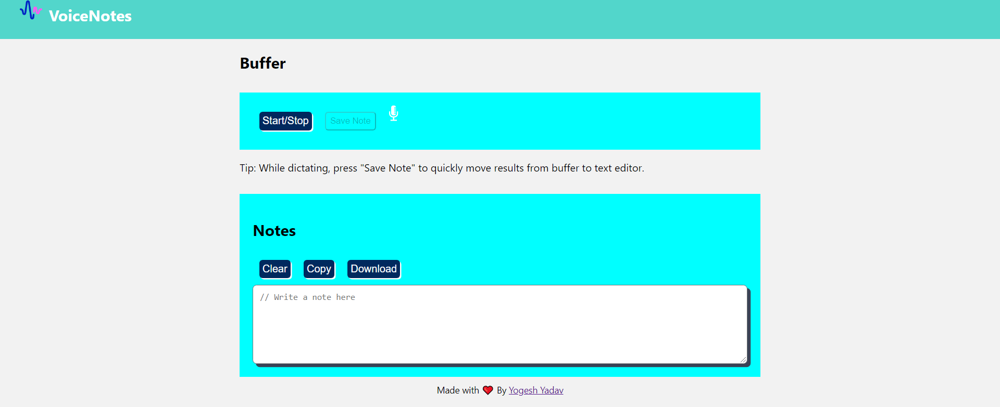

# Overview

VoiceNotes lets you type with your voice.

_Technical description: A Single-Page Application making use of speech recognition API built with ReactJS_

## Features

- Single-Page Application using ReactJS.

- create buffer text before writing to actual editor

- Copy text editor content to clipboard.

- download text editor content as .txt file

## Demo

You can see a running version of the application at
[demo](https://dev.d3pfrhmntkwg6h.amplifyapp.com/).

## Screenshots

## Installation

This project was bootstrapped with [Create React App](https://github.com/facebookincubator/create-react-app)
and requires [NPM](https://docs.npmjs.com/) to be installed.

    git clone https://github.com/yogeshjournal/voicenotes.git
    cd notes-react-app
    npm install

## Usage

    npm start
